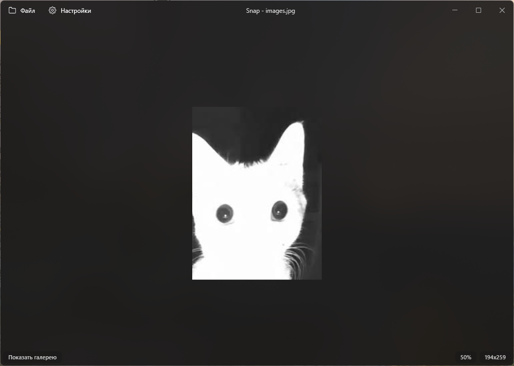
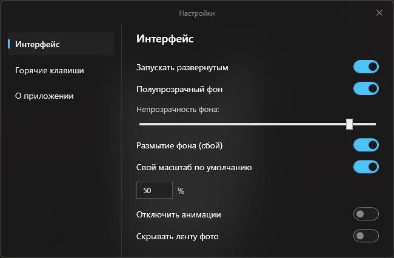

[English](README.md) | [Русский](README.ru.md) | **<kbd>Українська</kbd>**

  
  <h1><strong>Snap</strong></h1>

Сучасний мінімалістичний переглядач фотографій для Windows, створений на WPF із використанням апаратного прискорення.

## Підтримувані формати

Snap підтримує всі популярні формати зображень:
- **JPEG** (.jpg, .jpeg)
- **PNG** (.png)
- **GIF** (.gif — включно з відтворенням анімацій)
- **WEBP** (.webp — сучасний формат з інтернету)
- **TIFF** (.tif, .tiff — професійні зображення у високій якості)
- **BMP** (.bmp)
- **SVG** (.svg — векторна графіка)
- **ICO** (.ico — іконки Windows)

## Інтерфейс

